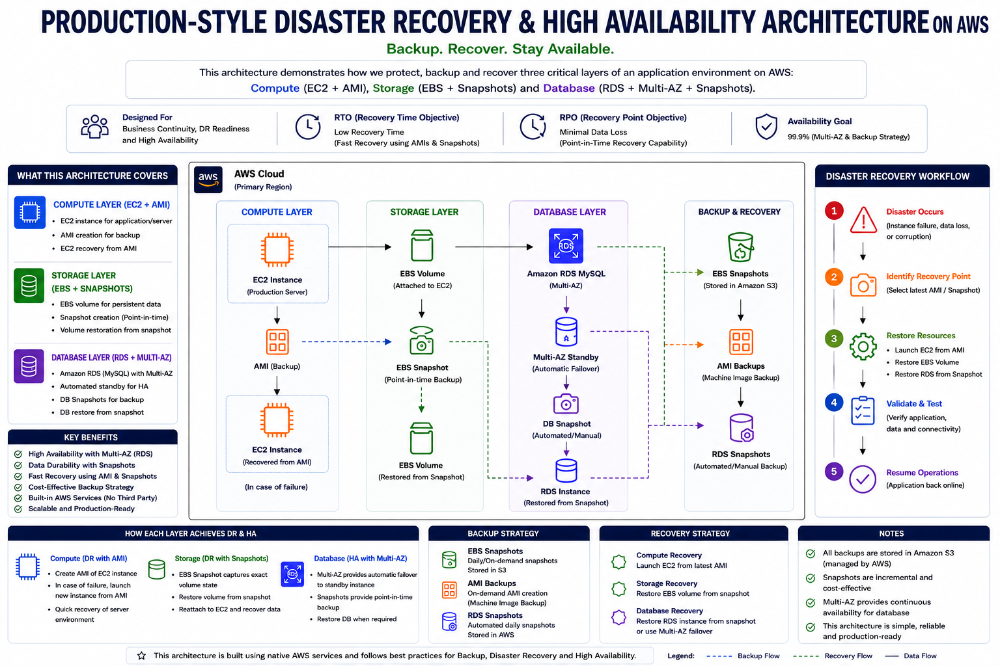

# 🚨 Production-Style Disaster Recovery & High Availability on AWS

<p align="center">


</p>

<p align="center">

Production-style AWS implementation demonstrating Disaster Recovery, Backup Strategies, Recovery Workflows and High Availability concepts using EC2, EBS and RDS.

</p>

---

# ❓ What happens when your production system suddenly goes down?

Imagine:

❌ Your application server crashes at 2 AM  
❌ A database outage affects users  
❌ Critical data gets lost  
❌ Human mistakes accidentally terminate resources  
❌ Downtime impacts customers and business operations  

In real cloud environments, failures are not a matter of **if** — but **when**.

Organizations prepare for these situations using **Disaster Recovery strategies and backup workflows**.

This project demonstrates a production-style AWS Disaster Recovery implementation using:

✅ EC2 AMI Backup & Recovery  
✅ EBS Snapshot & Volume Restoration  
✅ RDS Snapshot Recovery  
✅ Multi-AZ concepts  
✅ Recovery workflow validation  
✅ High Availability understanding  

---

# 🏗️ Architecture Diagram

<div align="center">



</div>

---

# ⚡ Architecture Overview

This architecture demonstrates how production systems improve reliability using:

🔹 Application hosted on EC2  

🔹 Database hosted on Amazon RDS  

🔹 AMI backups for infrastructure recovery  

🔹 EBS snapshots for storage recovery  

🔹 RDS snapshots for database recovery  

🔹 Multi-AZ concepts for High Availability  

🔹 Backup and restore workflows to reduce downtime  

---

# 🔄 Disaster Recovery Workflow

### EC2 Recovery

EC2 Instance  
↓  
Create AMI Backup  
↓  
Simulate Failure  
↓  
Launch New EC2 using AMI  
↓  
Application Restored  

---

### EBS Recovery

EBS Volume  
↓  
Create Snapshot  
↓  
Restore Volume  
↓  
Attach Restored Volume  
↓  
Data Recovery Verified  

---

### RDS Recovery

RDS Database  
↓  
Create Snapshot  
↓  
Restore Database  
↓  
Application Connectivity Restored  

---

# 📁 Repository Structure

```bash
production-style-disaster-recovery-and-high-availability-on-aws/

├── architecture/
│ └── arc.png
│
├── implementation-guide/
│ ├── ebs-snapshot-and-restore/
│ ├── ec2-ami-backup-and-recovery/
│ └── rds-snapshot-recovery/
│
├── video-demo/
│
├── documentation/
│
└── README.md
```

# 📸 Implementation Guide

Detailed hands-on implementation screenshots and walkthroughs:

### 📦 EBS Snapshot & Restore

Backup and restoration workflow using EBS snapshots.

👉 **[Click Here](./implementation-guide/ebs-snapshot-and-restore)**

---

### 🖥️ EC2 Backup & Recovery

AMI-based EC2 backup and recovery implementation.

👉 **[Click Here](./implementation-guide/ec2-backup-and-recovery)**

---

### 🗄️ RDS Multi-AZ & Recovery

Database availability and recovery implementation.

👉 **[Click Here](./implementation-guide/rds-multi-az-and-recovery)**

---


# 📄 Documentation

Complete project documentation with architecture explanation, screenshots, implementation details, recovery workflow, learnings, and notes.

📘 [View Documentation](./documentation/Disaster_Doc.pdf)

---

# 🎥 Project Demo

Watch implementation walkthrough and recovery demonstrations:

📹 [View Demo Videos](./video-demo)

---

# 💡 Key Learnings

✔ Difference between backup and recovery  

✔ Infrastructure restoration using AMIs  

✔ EBS volume recovery strategies  

✔ Database restoration workflows  

✔ Disaster Recovery planning concepts  

✔ Business continuity thinking  

✔ Production-style cloud architecture understanding  

---

# 👨‍💻 Author

## Adhithyan Sivaraman T

Computer Science and Engineering student passionate about:

☁️ Cloud Computing  
⚙️ DevOps  
🚀 Production Architecture  
📘 Project-Based Learning  

Everything I build is documented in a structured way through architecture diagrams, implementation guides, technical documentation and consistently shared on GitHub and LinkedIn as part of my learning journey.

---

# 🔗 Connect With Me

LinkedIn:

www.linkedin.com/in/adhithyan-sivaraman-t-399b5b362

GitHub:

https://github.com/Adhithyan-10

---

⭐ If you found this project useful, consider giving it a star.
