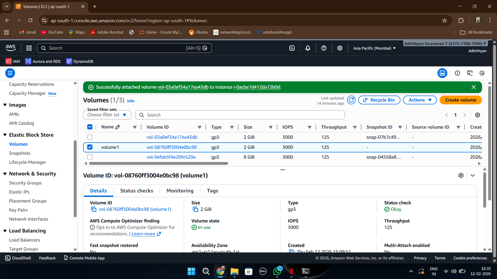
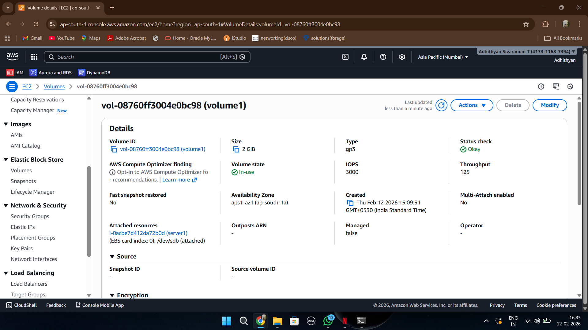
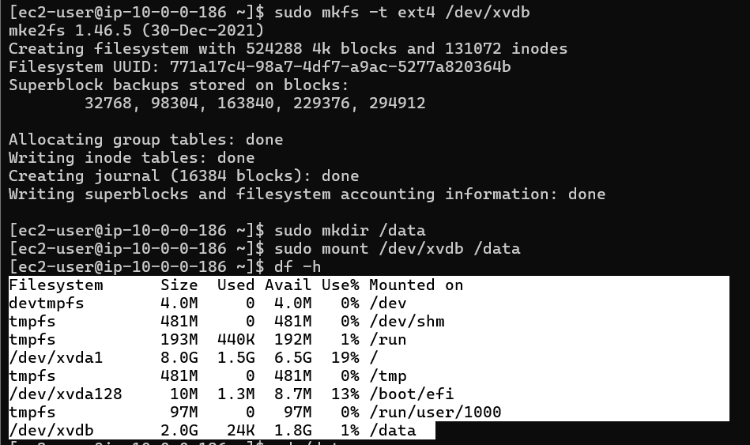
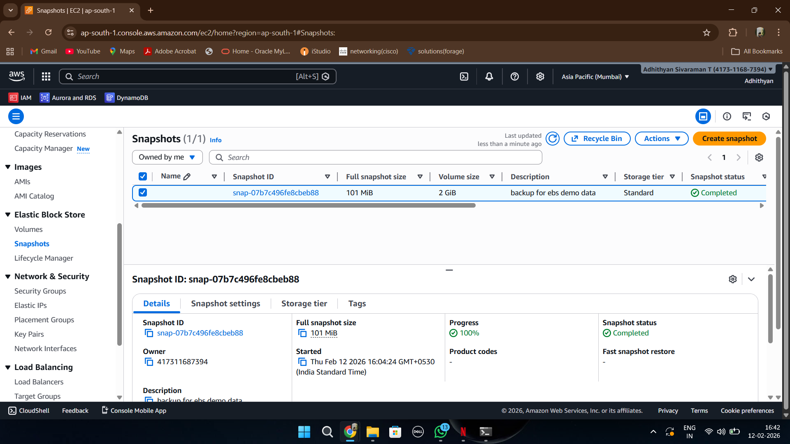
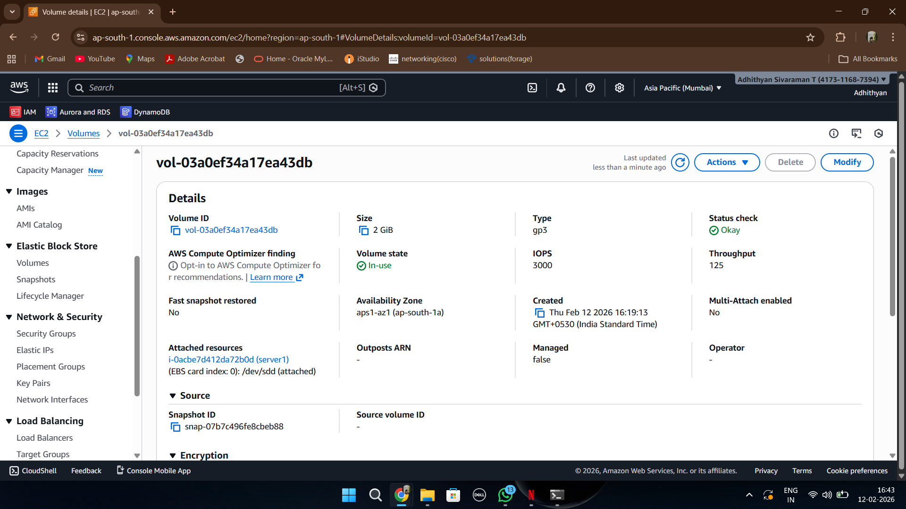
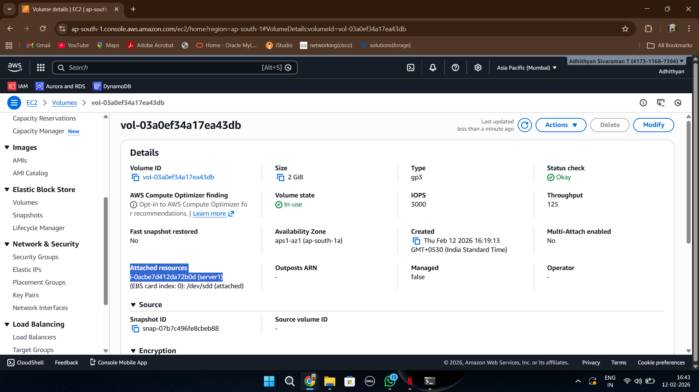
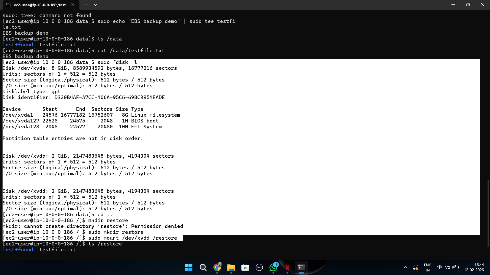

# EBS Snapshot & Restore — Storage Layer Disaster Recovery

## Overview

This implementation demonstrates how Amazon EBS snapshots are used for:

- persistent storage backup
- disaster recovery
- point-in-time restoration
- data recovery validation

The workflow simulates a real-world production scenario where application data stored on an EBS volume is recovered after storage failure using EBS snapshots.

---

# AWS Services Used

| Service | Purpose |
|---|---|
| Amazon EC2 | Compute server |
| Amazon EBS | Persistent block storage |
| EBS Snapshots | Backup and restore |
| Linux Filesystem | Disk mounting and storage validation |

---

# Implementation Workflow

```text
Create EBS Volume
        ↓
Attach Volume to EC2
        ↓
Format & Mount Disk
        ↓
Write Data to Volume
        ↓
Create EBS Snapshot
        ↓
Simulate Failure
        ↓
Restore Volume from Snapshot
        ↓
Attach Restored Volume
        ↓
Recover Data Successfully
```

---

# Step-by-Step Implementation

---

## 1️⃣ EBS Volume Created



This screenshot shows the creation of a new Amazon EBS volume.

### Key Learning
- EBS acts as persistent block storage
- Separate storage layer improves durability
- Commonly used for application data and databases

---

## 2️⃣ Volume Attached to EC2



This screenshot shows the EBS volume attached to the EC2 instance.

### Key Learning
- EBS volumes must be attached before use
- Storage becomes available to Linux OS
- EBS behaves like an additional disk

---

## 3️⃣ Disk Detected in EC2 Terminal


This screenshot validates that Linux successfully detected the attached EBS volume.

### Commands Used

```bash
lsblk
fdisk -l
```

### Key Learning
- Linux identifies attached storage devices
- EBS appears as block storage device

---

## 4️⃣ Mounted Volume in Linux



This screenshot shows the EBS volume formatted and mounted successfully.

### Commands Used

```bash
sudo mkfs -t ext4 /dev/xvdb
sudo mkdir /data
sudo mount /dev/xvdb /data
```

### Key Learning
- Linux uses mount points for storage access
- Filesystem formatting prepares disk for usage

---

## 5️⃣ Data Written to EBS


This screenshot shows application data written into the mounted EBS volume.

### Key Learning
- Data persists independently from EC2 lifecycle
- EBS supports durable application storage

---

## 6️⃣ Snapshot Created



This screenshot shows successful creation of an EBS snapshot.

### Key Learning
- Snapshots provide point-in-time backups
- Used for recovery and disaster recovery workflows

---

## 7️⃣ New Volume from Snapshot



This screenshot shows a new EBS volume restored from the snapshot backup.

### Key Learning
- Snapshots enable storage restoration
- Supports recovery after disk failure

---

## 8️⃣ Restored Volume Attached



This screenshot shows the restored EBS volume attached to the EC2 instance.

### Key Learning
- Restored storage can be reattached quickly
- Enables disaster recovery workflow

---

## 9️⃣ Restored Disk Mounted



This screenshot validates successful recovery of stored data from the restored EBS volume.

### Key Learning
- Snapshot restoration preserves application data
- Demonstrates successful disaster recovery implementation

---

# Disaster Recovery Concepts Demonstrated

## Point-in-Time Backup
EBS snapshots capture the exact state of storage volumes.

---

## Storage Layer Recovery
Data can be restored quickly after storage failure.

---

## Persistent Storage
Application data remains protected independently from EC2 lifecycle.

---

## Backup Validation
Recovery testing confirms snapshot reliability.

---

# Final Outcome

Successfully implemented:
- EBS volume management
- Linux storage mounting
- Snapshot-based backup
- Volume restoration
- Storage layer disaster recovery
- Data recovery validation
