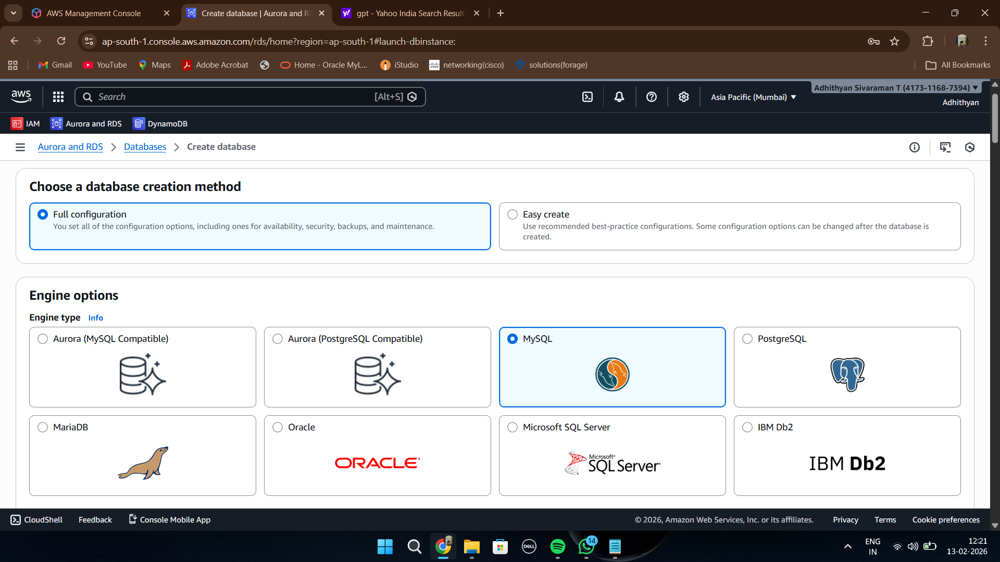
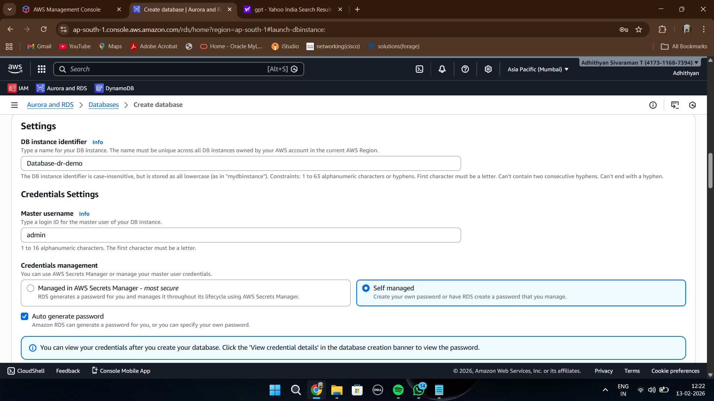
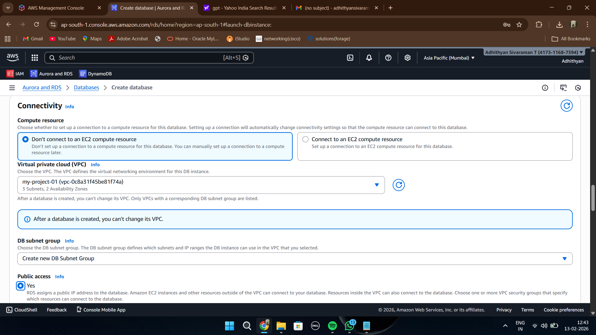
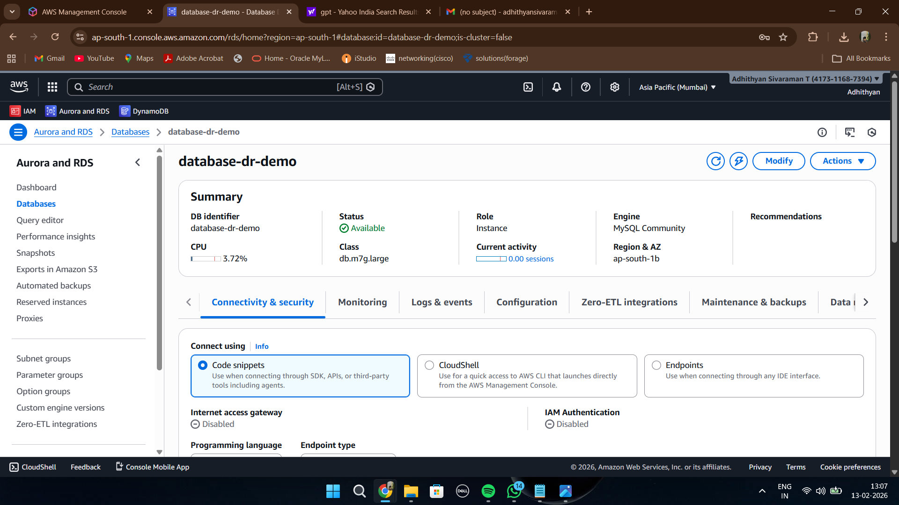
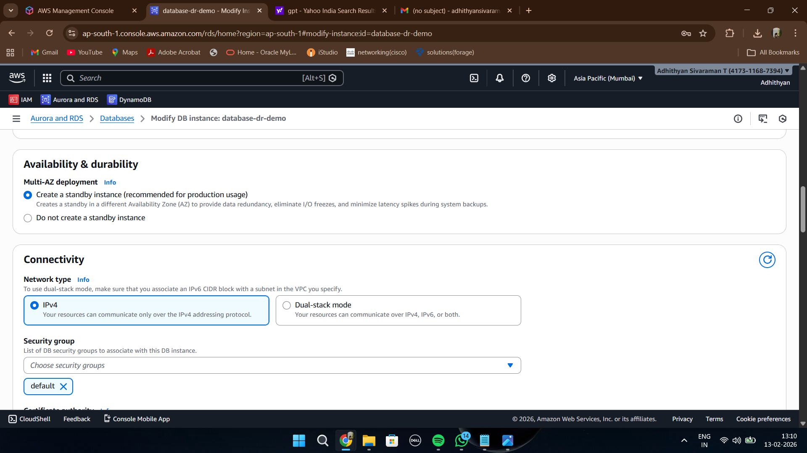
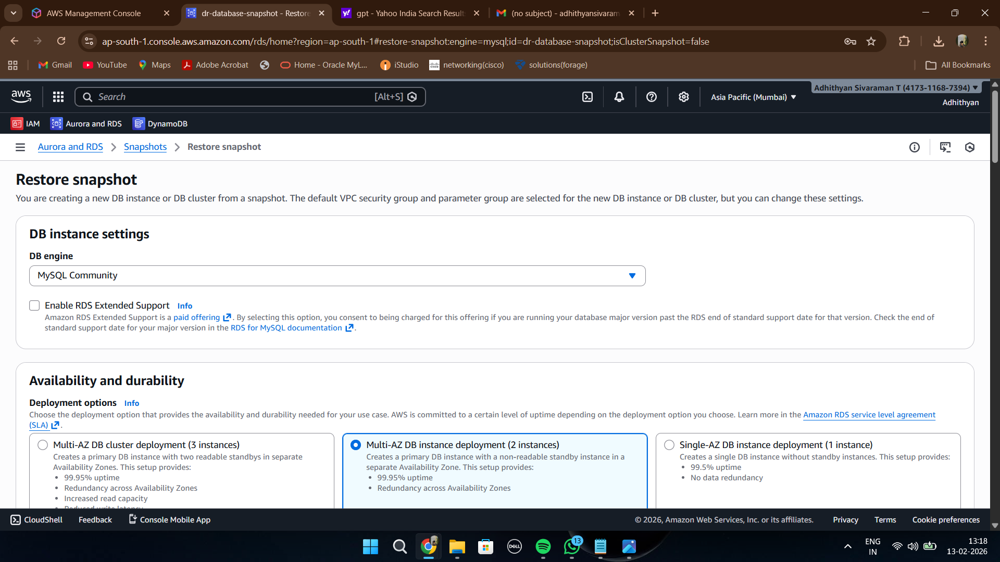

# RDS Multi-AZ Backup & Recovery – Database Layer Disaster Recovery

## Overview

This implementation demonstrates how Amazon RDS Multi-AZ deployment and database snapshots can be used to:

- improve database availability
- provide automatic failover capability
- create database backups
- restore databases during disaster recovery
- reduce downtime for production workloads

The workflow simulates a production-style database disaster recovery architecture using Amazon RDS MySQL, Multi-AZ deployment and RDS snapshots.

---

# AWS Services Used

| Service | Purpose |
|---|---|
| Amazon RDS | Managed relational database |
| MySQL | Database engine |
| Multi-AZ Deployment | High availability and failover |
| RDS Snapshots | Database backup and recovery |
| Amazon VPC | Network isolation |

---

# Architecture Workflow

1. Configure RDS database engine
2. Configure database credentials
3. Configure networking and connectivity
4. Launch RDS database
5. Enable Multi-AZ deployment
6. Create database snapshot
7. Restore database from snapshot
8. Validate disaster recovery process

---

# Step-by-Step Implementation

---

## Step 1 – Configure RDS Database Engine

Amazon RDS MySQL database engine was selected for the disaster recovery implementation.

---

## Step 2 – Configure Database Credentials

Database identifier, administrator username and authentication settings were configured.

---

## Step 3 – Configure Networking & Connectivity

VPC, subnet group and connectivity settings were configured for the RDS instance.

---

## Step 4 – Launch RDS Database Instance

The RDS database instance was successfully created and became available.

---

## Step 5 – Configure Multi-AZ Deployment

Multi-AZ deployment was enabled to provide high availability and automatic failover capability.

---

## Step 6 – Create Database Snapshot

A manual RDS snapshot backup was created for disaster recovery purposes.

---

## Step 7 – Restore Database from Snapshot

The database restoration workflow was initiated using the previously created RDS snapshot.

---

# Recovery Validation

The database disaster recovery process was successfully validated by:

- creating database backups using RDS snapshots
- enabling Multi-AZ failover capability
- restoring database infrastructure from snapshot
- validating production-style backup strategy
- demonstrating high availability architecture

---

# Key Learning Outcomes

- Understanding Amazon RDS architecture
- Multi-AZ high availability concepts
- Database backup strategies
- Snapshot-based recovery workflow
- Production database resilience
- Disaster recovery implementation on AWS

---

# High Availability Benefits

| Benefit | Description |
|---|---|
| Automatic Failover | Standby database for HA |
| Reduced Downtime | Improved application availability |
| Data Protection | Snapshot-based backups |
| Disaster Recovery | Restore databases quickly |
| Managed Database | AWS-managed infrastructure |

---

# Conclusion

This project demonstrates a production-style database disaster recovery architecture using Amazon RDS Multi-AZ deployment and RDS snapshots. By combining high availability with snapshot-based recovery, organizations can improve database resilience, minimize downtime and protect critical application data.

